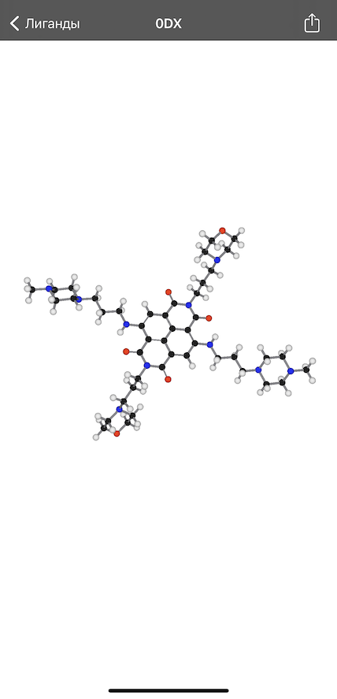

# SwiftyProtein

3D-visualization of Ligand models from PDB (Protein Data Bank)

## Face Id for data protection

## Ligand list from file /SwiftyProtein/SwiftyProtein/Ligands/ligands.txt

## Search for ligands

## 3D visualization with the ability to rotate the camera and zoom

## Highlighted atom information

